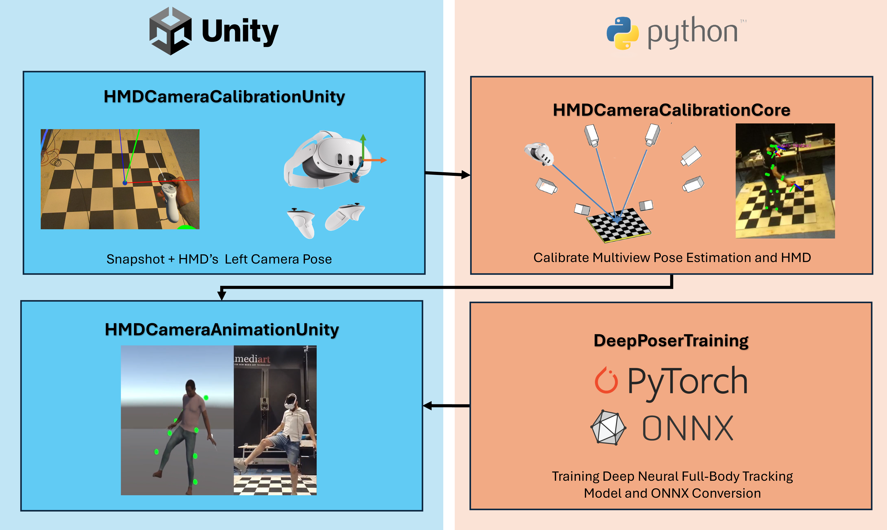

# MuCHMDPoser: Multiview Camera Poser in VR

MuCaPoser is a full-body self-avatar tracking system for VR that combines multiview RGB pose estimation with sparse HMD tracking. Using a multiview camera rig alongside the headset's own 6-DoF pose and controller/hand tracking, the system estimates and animates a full-body avatar in real time without requiring external body-worn trackers.



## Structure 

| Submodule | Type | Role |
|---|---|---|
| [`HMDCameraCalibrationUnity`](https://github.com/antmaio/HMDCameraCalibrationUnity) | Unity | Captures a checkerboard snapshot through the HMD's passthrough cameras alongside HMD pose |
| [`HMDCameraCalibrationCore`](https://github.com/antmaio/HMDCameraCalibrationCore) | Python | Processes the checkerboard snapshot to compute the extrinsics of the RGB cameras relative to the HMD |
| [`DeepPoserTraining`](https://github.com/antmaio/MuCaPoserTraining) | Python | Deep-learning training procedure for the self-avatar animation model |
| [`HMDCameraAnimationUnity`](https://github.com/antmaio/HMDCameraAnimationUnity) | Unity | Runtime self-avatar animation: consumes RGB camera streams + HMD/controller tracking, runs the trained model, and drives the avatar |


Each submodule is an independent git repository with its own history, included here as a git submodule.

## Installation 

Clone the repository and its submodules:
```bash
git clone --recurse-submodules https://github.com/antmaio/MuCHMDPoser.git
```
Follow the instructions in the submodules for each respective task.

## How they interact

1. **`HMDCameraCalibrationUnity`** captures a checkerboard snapshot from the
   HMD's passthrough RGB cameras.
2. **`HMDCameraCalibrationCore`** processes that snapshot to compute the
   extrinsic calibration between each RGB camera and the HMD tracking frame.
3. **`DeepPoserTraining`** trains the pose-fusion model offline, combining
   multiview RGB pose estimation with sparse HMD/controller tracking signals,
   and exports trained weights.
4. **`HMDCameraAnimationUnity`** loads the calibration output and trained
   weights at runtime to animate the user's full-body self-avatar live,
   inside the headset.

## Citations 

## License